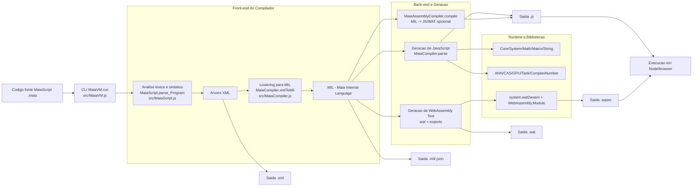

# Arquitetura do Compilador MaiaScript

```mermaid
flowchart LR
    SRC[Codigo fonte MaiaScript .maia]
    CLI[CLI MaiaVM.run\nsrc/MaiaVM.js]

    subgraph FE[Front-end do Compilador]
        LEXPARSE[Analise lexica e sintatica\nMaiaScript.parse_Program\nsrc/MaiaScript.js]
        XML[Arvore XML]
        MILGEN[Lowering para MIL\nMaiaCompiler.xmlToMil\nsrc/MaiaCompiler.js]
        MIL[MIL - Maia Internal Language]
    end

    subgraph BE[Back-end e Geracao]
        JSGEN[Geracao de JavaScript\nMaiaCompiler.parse]
        WATGEN[Geracao de WebAssembly Text\nwat + exports]
        ASMC[MaiaAssemblyCompiler.compile\nMIL -> JS/WAT opcional]
    end

    subgraph RT[Runtime e Bibliotecas]
        CORE[Core/System/Math/Matrix/String]
        EXTRA[ANN/CAS/GPU/Task/ComplexNumber]
        WASMRT[system.wat2wasm + WebAssembly.Module]
    end

    OUTJS[Saida .js]
    OUTMIL[Saida .mil/.json]
    OUTXML[Saida .xml]
    OUTWAT[Saida .wat]
    OUTWASM[Saida .wasm]
    EXEC[Execucao em Node/browser]

    SRC --> CLI --> LEXPARSE --> XML --> MILGEN --> MIL
    MIL --> JSGEN --> OUTJS
    MIL --> WATGEN --> OUTWAT
    MIL --> ASMC --> OUTJS
    MIL --> OUTMIL
    XML --> OUTXML

    JSGEN --> CORE
    JSGEN --> EXTRA
    WATGEN --> WASMRT --> OUTWASM
    OUTJS --> EXEC
    OUTWASM --> EXEC
```
