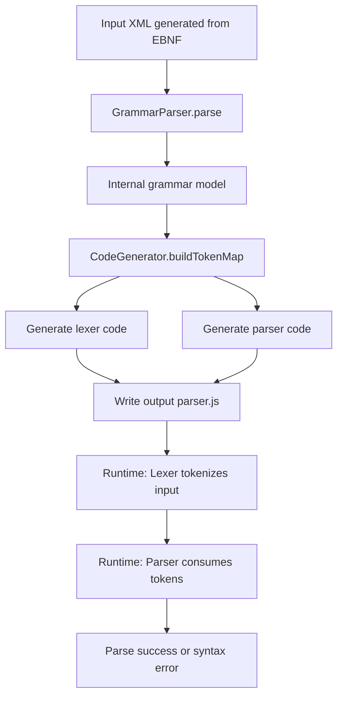
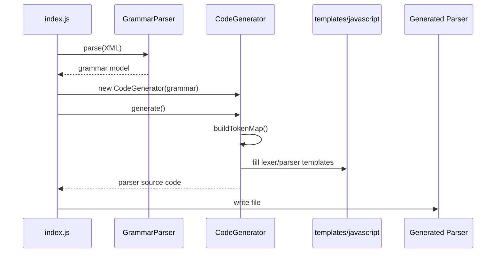

# Parser Generator Algorithm

This document explains how the current parser generator works, the code generation strategies, and the main trade-offs.

## 1) High-level pipeline

### Step summary

1. `index.js` loads XML.
2. `GrammarParser` converts XML into an internal grammar model.
3. `CodeGenerator` builds token mappings and regex patterns.
4. Templates are filled to produce final JavaScript source.
5. Generated parser runs with a lexer + recursive-descent parser.

---

## 2) Core modules and responsibilities

- `grammar-parser.js`
  - Parses syntax and lexical productions from XML.
  - Normalizes quantifiers (`?`, `*`, `+`).
  - Decodes character classes and `#xNN` code points.

- `code-generator.js`
  - Builds `tokenMap` for terminals and lexical tokens.
  - Converts lexical productions into regex fragments.
  - Generates parser methods from syntax productions.

- `templates/javascript.js`
  - Provides lexer/parser code skeleton.
  - Hosts runtime tokenization and consumption logic.

---

## 3) Internal grammar model

The generator uses a normalized model with:

- Syntax items: `terminal`, `nonterminal`, `group`
- Lexical items: `literal`, `tokenRef`, `charclass`, `group`, `anyChar`
- Quantifiers: `exactly1`, `optional`, `zeroOrMore`, `oneOrMore`

This normalization lets code generation remain mostly independent from XML shape details.

---

## 4) Lexical code generation strategy

## 4.1 Token map and selection

`buildTokenMap()`:

- Recursively collects syntax literal terminals (including nested groups).
- Adds lexical token definitions from grammar.
- Marks source type (`literal` vs `lexical`) to control emission.

## 4.2 Regex building

`tokenPatternToRegexInternal()` builds regexes with:

- Alternation support across lexical patterns.
- Recursive token references with recursion guard (`visiting` set).
- Char-class handling with negation and safe escaping.
- Quantifier wrapping per item.

## 4.3 Escaping and safety

- `escapeRegex()` escapes regex meta chars and control chars.
- `escapeCharClassContent()` safely escapes control chars, `\`, and `]`.
- `regexCanMatchEmpty()` avoids emitting tokens that can cause zero-length loops.

## 4.4 Runtime lexer policy

Generated lexer uses:

- **Maximal munch**: longest match wins.
- **Tie-breaker**: skip token preferred on equal match length.
- Appends synthetic `EOF` token at end.

---

## 5) Parser code generation strategy

## 5.1 Recursive-descent shape

Each syntax production generates one `parse<RuleName>()` method.

- Sequences become ordered consume/call statements.
- Quantifiers become loops or optional blocks.
- Groups generate nested alternative attempts.

## 5.2 Alternatives and backtracking

For multi-alternative rules:

- Save start position.
- Try each alternative in order.
- On failure, reset position and try next.
- Throw explicit error if all fail.

## 5.3 Runtime safety details

- `peek()` returns synthetic EOF fallback if out-of-range.
- `consume()` records expected/found mismatch for diagnostics.
- Guard logic in repetition blocks prevents no-progress loops.

---

## 6) Generation sequence (interaction view)

---

## 7) Complexity and behavior notes

- Lexer runtime is approximately $O(n \cdot p)$ where:
  - $n$ = input length
  - $p$ = number of token patterns tested per position
- Parser complexity depends on grammar ambiguity and backtracking depth.
- Current strategy favors correctness and readability over optimal packrat performance.

---

## 8) Known limitations and future directions

- Context-sensitive lexical semantics are still simplified compared to full REx behavior.
- Full support for advanced lookahead/difference semantics can be improved.
- Multi-language backend abstraction is a next architectural step.

See [TODO.md](TODO.md) for prioritized technical roadmap.
