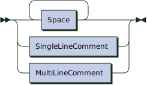

<link rel="stylesheet" href="markdown.css">

[⇦ Previous page](using-an-external-lexer.md) &nbsp;&nbsp;│&nbsp;&nbsp; [⇧ Back to index](../README.md#-rex-parser-generator) &nbsp;&nbsp;│&nbsp;&nbsp; [Next page ⇨ ](sample-grammars/README.md)

&nbsp;
# Grammar Tools

These tools can help with creating and visualizing REx grammars:

 - [**ebnf-convert** Grammar Converter](#ebnf-convert-grammar-converter)
 - [**RR** Railroad Diagram Generator](#rr-railroad-diagram-generator)

## **ebnf-convert** Grammar Converter

**ebnf-convert** Grammar Converter is a tool that helps transform various grammar formats into W3C EBNF, which is the basis of REx EBNF. It is particularly useful for importing grammars that were made for other parser generators into a REx environment. 

It can be used both as a command line tool and with a simple browser-based UI.

The converter can handle input in formats like ANTLR, JavaCC, or Bison and transforms them in W3C EBNF syntax for compatibility with REx.

**ebnf-convert** is available:

 - as a GitHub project: [`https://github.com/GuntherRademacher/ebnf-convert`](https://github.com/GuntherRademacher/ebnf-convert)
 - as online converter: [`https://www.bottlecaps.de/ebnf-convert`](https://www.bottlecaps.de/ebnf-convert)

## **RR** Railroad Diagram Generator

**RR** Railroad Diagram Generator is a tool designed to create syntax diagrams (also known as railroad diagrams) from EBNF grammars. These diagrams visually represent grammar rules in an intuitive way, making it easier to understand and follow language specifications or parsing rules. The diagrams can also be used for grammar documentation.

**RR**  can be used both as a command line tool and with a browser-based UI.

It accepts grammars in REx EBNF, and creates one diagram per rule as SVG or PNG graphics, embedding them in HTML, XHTML, or Markdown pages. In HTML or XHTML, the generated pages and diagrams have clickable nodes (not possible in Markdown).

**RR** is available:

 - as a GitHub project: [`https://github.com/GuntherRademacher/rr`](https://github.com/GuntherRademacher/rr)
 - as online generator: [`https://www.bottlecaps.de/rr/ui`](https://www.bottlecaps.de/rr/ui)

Below is a simple example of an **RR**-generated diagram. Complete diagrams of the REx grammar can be found on page [Grammar for Parsing EBNF](grammar-for-parsing-ebnf.md#syntax-diagrams).

**Whitespace:**



```
Whitespace
         ::= ( Space | SingleLineComment | MultiLineComment )+
          /* ws: definition */
```

&nbsp;
---
[⇦ Previous page](using-an-external-lexer.md) &nbsp;&nbsp;│&nbsp;&nbsp; [⇧ Back to index](../README.md#-rex-parser-generator) &nbsp;&nbsp;│&nbsp;&nbsp; [Next page ⇨ ](sample-grammars/README.md)